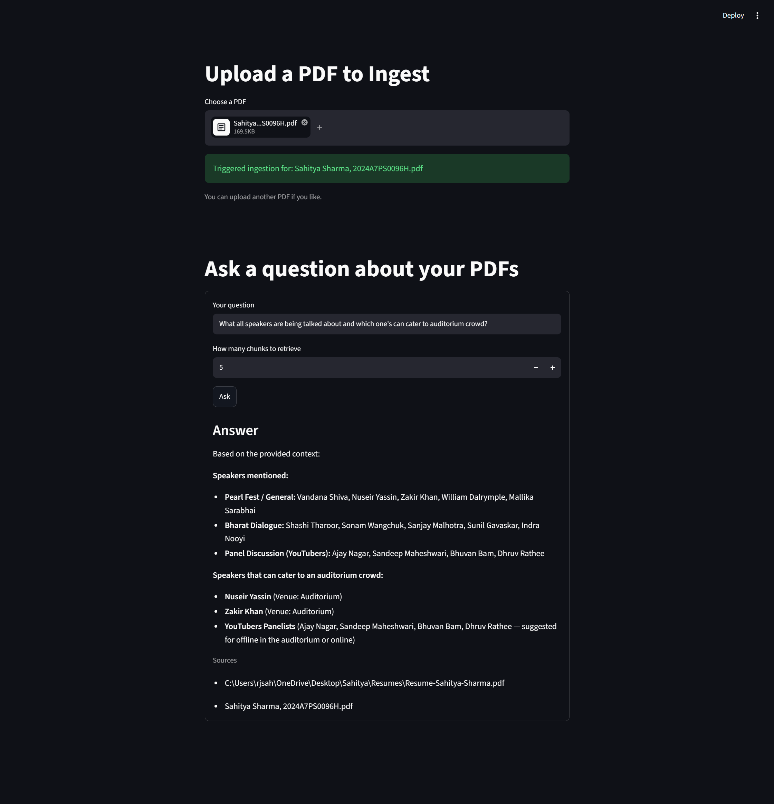

# RAG AI Agent

A local Retrieval-Augmented Generation (RAG) application that lets you
upload PDF documents and ask questions about their contents. The
application extracts and chunks PDF text, generates embeddings with
Google Gemini, stores the vectors in Qdrant, retrieves the most relevant
chunks for a question, and uses Gemini to generate an answer grounded
only in the retrieved context. Inngest is used to orchestrate the
ingestion and query workflows, while Streamlit provides the frontend and
FastAPI exposes the backend workflow.

## Screenshot



## Tech Stack

-   **Python 3.10+**
-   **uv** - Python project and dependency management
-   **Streamlit** - frontend UI
-   **FastAPI** - backend API/application server
-   **Inngest** - event-driven workflow orchestration
-   **Google Gemini** - text embeddings and LLM-based answer generation
-   **Qdrant** - vector database for storing and searching document
    embeddings
-   **LlamaIndex** - PDF loading and text chunking
-   **Pydantic** - structured data models
-   **python-dotenv** - environment variable management
-   **Uvicorn** - ASGI server

## How It Works

The application follows a simple RAG pipeline:

``` text
                    PDF Upload
                        │
                        ▼
                  Streamlit UI
                        │
                        ▼
                Inngest Event
                 rag/ingest_pdf
                        │
                        ▼
              Load PDF with LlamaIndex
                        │
                        ▼
                 Text Chunking
              (1000 chars / 200 overlap)
                        │
                        ▼
             Gemini Embeddings
             gemini-embedding-001
                        │
                        ▼
                    Qdrant
                 Vector Storage
```

For a question:

``` text
                  User Question
                        │
                        ▼
                  Streamlit UI
                        │
                        ▼
                Inngest Event
                rag/query_pdf_ai
                        │
                        ▼
             Embed the Question
                        │
                        ▼
              Search Qdrant
                (Top-K chunks)
                        │
                        ▼
             Retrieved Context
                        │
                        ▼
             Gemini 3.6 Flash
                        │
                        ▼
                    Answer
```

## Project Structure

``` text
RAG AI Agent/
│
├── screenshots/
│   └── frontend.png        # Screenshot of the working frontend
│
├── src/                    # Source/package directory
├── uploads/                # Uploaded PDF files
│
├── custom_types.py         # Pydantic models for RAG data
├── data_loader.py          # PDF loading, chunking, and embeddings
├── main.py                 # FastAPI app and Inngest workflows
├── streamlit_app.py        # Streamlit frontend
├── vector_db.py            # Qdrant vector database operations
│
├── pyproject.toml          # Project configuration and dependencies
├── uv.lock                 # Locked dependency versions
├── .python-version         # Python version configuration
├── .gitignore              # Git ignore rules
└── README.md               # Project documentation
```

## RAG Pipeline

### 1. PDF ingestion

A PDF is uploaded through the Streamlit frontend. The file is saved
locally and an Inngest event is triggered for ingestion.

The PDF is loaded using LlamaIndex's `PDFReader`, after which the
extracted text is split into chunks using `SentenceSplitter`. The
current configuration uses a chunk size of 1000 characters with an
overlap of 200 characters.

### 2. Generate embeddings

Each text chunk is converted into a vector using Google's
`gemini-embedding-001` embedding model. The application uses an
embedding dimensionality of 3072.

### 3. Store vectors in Qdrant

The generated vectors, along with the original chunk text and source
filename, are stored in a Qdrant collection named `docs`.

Cosine similarity is used for vector search.

### 4. Retrieve relevant context

When a user asks a question, the question is embedded using the same
Gemini embedding model. Qdrant then returns the most relevant chunks.
The frontend allows the user to choose how many chunks to retrieve, with
a default of 5.

### 5. Generate the answer

The retrieved chunks are passed as context to Gemini. The model is
instructed to answer using only the supplied context, helping keep the
response grounded in the uploaded documents.

## Running the Project

### Prerequisites

Make sure you have:

-   Python 3.10+
-   [uv](https://docs.astral.sh/uv/)
-   Qdrant running locally
-   A Google Gemini API key
-   Inngest Dev Server

### 1. Clone the repository

``` bash
git clone https://github.com/Sahitya-bits/PDF-RAG-Q-A-Assistant
cd rag-ai-agent
```

### 2. Install dependencies

This project uses **uv** for dependency management.

``` bash
uv sync
```

### 3. Configure environment variables

Create a `.env` file in the project root:

``` env
GEMINI_API_KEY=your_gemini_api_key
INNGEST_API_BASE=http://127.0.0.1:8288/v1
```

`INNGEST_API_BASE` is optional because the application defaults to the
local Inngest API shown above.

### 4. Start Qdrant

The application expects Qdrant to be available at:

``` text
http://localhost:6333
```

Start your local Qdrant instance before running the application.

### 5. Start the Inngest Dev Server

Start the local Inngest development server according to your Inngest
setup.

The application uses Inngest events to trigger:

-   `rag/ingest_pdf`
-   `rag/query_pdf_ai`

### 6. Start the FastAPI/Inngest backend

Run:

``` bash
uv run uvicorn main:app --reload
```

### 7. Start the Streamlit frontend

In another terminal:

``` bash
uv run streamlit run streamlit_app.py
```

Open the Streamlit URL shown in your terminal.

## Using the Application

1.  Upload a PDF from the frontend.
2.  Wait for the ingestion event to complete.
3.  Enter a question about the uploaded PDF.
4.  Choose the number of chunks to retrieve using `Top-K`.
5.  Click **Ask**.
6.  The application retrieves relevant document chunks and generates an
    answer using Gemini.
7.  The source filenames used for the retrieved context are displayed
    below the answer.

## Configuration

### Chunking

The current chunking configuration is:

``` python
SentenceSplitter(
    chunk_size=1000,
    chunk_overlap=200
)
```

### Embeddings

``` text
Model: gemini-embedding-001
Dimensions: 3072
```

### Retrieval

The default number of retrieved chunks is:

``` text
Top-K = 5
```

The Streamlit UI allows values from 1 to 20.

### Vector Database

Qdrant is configured with:

``` text
Collection: docs
Distance: COSINE
Vector Dimension: 3072
```

## Key Components

### `data_loader.py`

Handles PDF loading, text extraction, chunking, and Gemini embedding
generation.

### `vector_db.py`

Provides the Qdrant storage layer. It creates the collection when
needed, upserts vectors with payloads, and performs similarity search.

### `main.py`

Contains the two main Inngest workflows:

-   **RAG: Ingest PDF** - loads, chunks, embeds, and stores PDF content.
-   **RAG: Query PDF** - embeds a question, retrieves relevant chunks,
    and generates the final answer.

### `streamlit_app.py`

Provides the user interface for uploading PDFs and asking questions. It
also polls the local Inngest API for workflow results.

### `custom_types.py`

Defines Pydantic models used to pass structured data between the
different RAG workflow steps.

## Notes

-   The current implementation processes the text extracted from PDFs.
    It does not implement dedicated image/vision processing for images
    embedded inside PDFs.
-   Qdrant is expected to run locally on port `6333`.
-   Inngest is configured for local development with
    `is_production=False`.
-   The LLM is instructed to use only the retrieved context when
    answering questions.
-   API keys should be stored in `.env` and should not be committed to
    Git.

## Future Improvements

Some possible extensions:

-   Support multiple document collections or users.
-   Add document deletion and re-indexing.
-   Store page numbers and richer metadata with each chunk.
-   Add OCR and multimodal processing for image-heavy PDFs.
-   Improve retrieval with hybrid search or reranking.
-   Stream generated answers to the frontend.
-   Add authentication and persistent document management.
-   Deploy Qdrant, Inngest, FastAPI, and Streamlit for production use.
